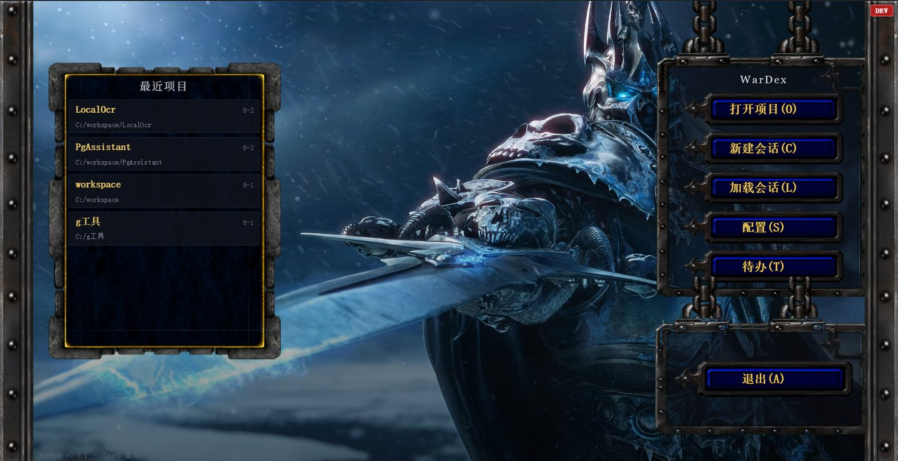
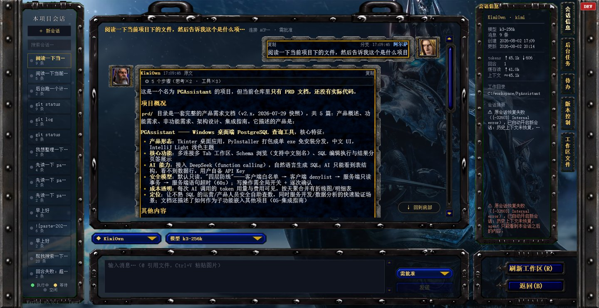
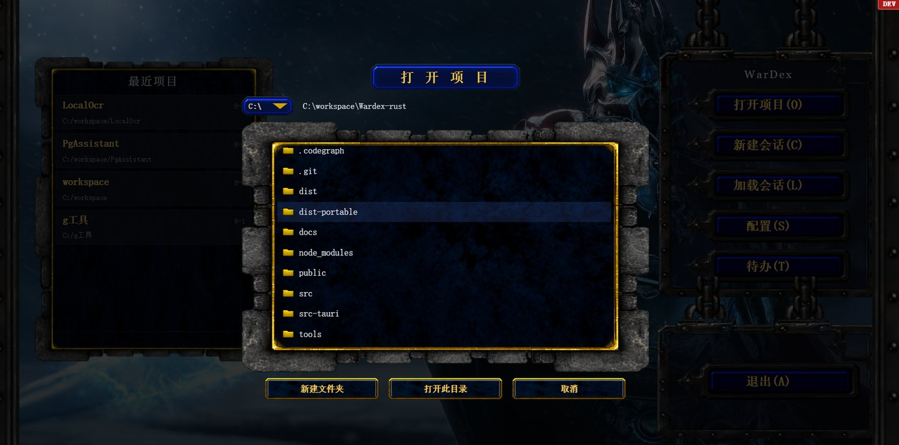
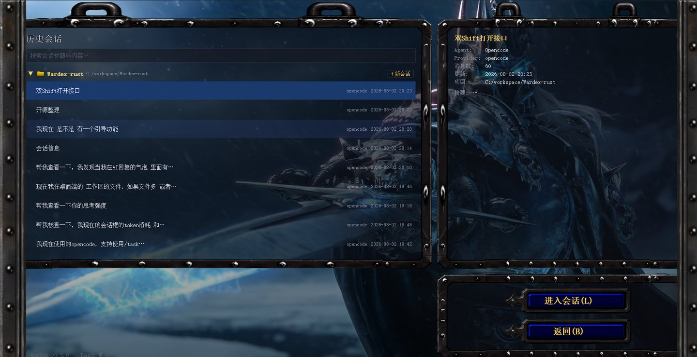
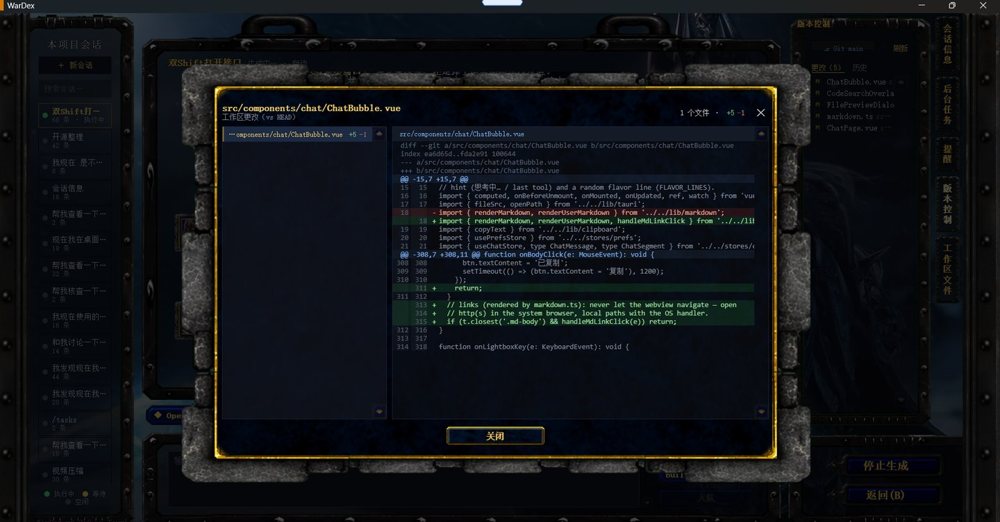
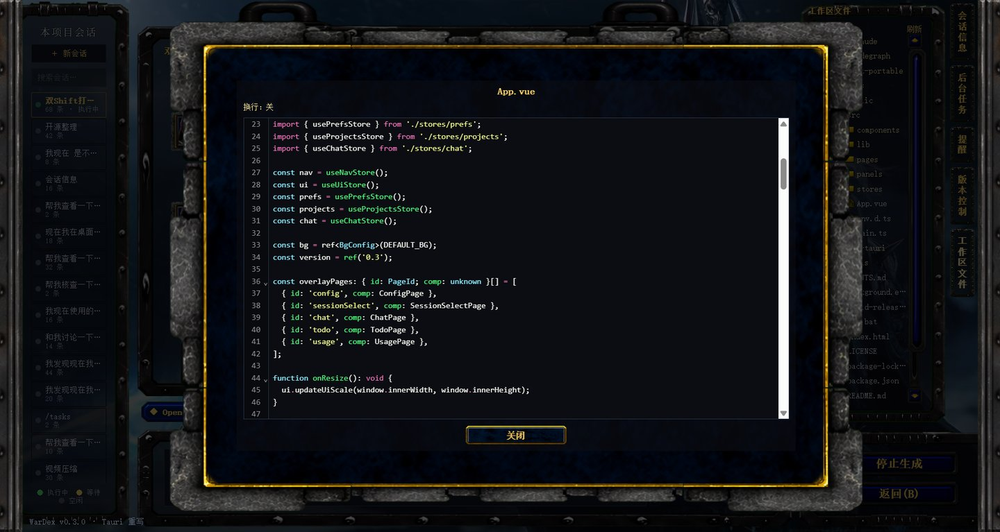

# WarDex

WarDex 是一款桌面端（Windows / macOS）AI 编程助手 GUI，采用魔兽争霸 III 风格自绘界面。内置 [Pi](https://github.com/badlogic/pi-mono) 编码 Agent（安装包 / 便携包自带编译好的 `pi` 二进制，运行时不需要 Node）；也可通过 [ACP](https://github.com/zed-industries/agent-client-protocol)（Agent Client Protocol，stdio JSON-RPC）连接 `kimi acp` / `claude-code-acp` / `codex-acp` / `opencode acp` 等 Agent CLI。提供多会话并行聊天、权限确认、图片发送、项目与会话管理、插件工坊、用量统计等功能。

## 功能特性

- **内置 Pi**：自包含 `pi` 二进制（源码以 git subtree 内置于 `third_party/pi`），懒启动、空闲回收；同一项目、同一 Agent 的多个会话共用一个 Pi 进程
- **多会话并行**：ACP 会话各自独立进程（软上限 3），互不阻塞
- **插件体系**：工具类（Pi extension）与界面类（侧边栏 / 浮窗）统一热管理；对话里可让 AI 写插件，设置页扫描后点「生效」
- **插件工坊**：每个项目可开独立工坊会话，只挂插件管理员，用来编写和调试插件
- **流式聊天**：增量渲染 + markdown、工具调用、子 Agent（subagent）跟踪
- **权限确认**：CLI 侧权限请求弹出窗口，支持临时放行/永久放行
- **会话与项目**：按项目分组、全文搜索、断线续写、会话用量统计
- **信息面板**：Git 历史、文件树、后台任务、提醒、待办、数据库
- **WC3 风格自绘 UI**：九宫格边框、三态按钮、铁轨装饰（自制素材）
- **多种 Agent 支持**：pi / kimi / claude / codex / opencode，支持自定义 provider

## 下载

安装包见 [GitHub Releases](https://github.com/Uther-Lightbringer/Wardex/releases)：

- Windows NSIS 安装器：`WarDex_<版本>_x64-setup.exe`
- Windows 便携版 ZIP：`WarDex-win64-<版本>.zip`（解压即可运行，可附 `make-desktop-shortcut.bat` 创建桌面快捷方式）
- macOS DMG：`WarDex_<版本>_aarch64.dmg`（Apple Silicon）/ `WarDex_<版本>_x64.dmg`（Intel）。未做 Apple 签名与公证，首次打开若提示「已损坏 / 无法验证开发者」，在终端执行 `xattr -dr com.apple.quarantine /Applications/WarDex.app` 后再打开

推送 `v*` 标签会触发 [Release workflow](.github/workflows/release.yml) 在 GitHub Actions 上自动构建 Windows + macOS 安装包并挂到对应 Release。源码版本随打包自动升 patch（`package.json` / `tauri.conf.json` / `Cargo.toml` 三处同步）。本地打当前源码的 Windows 便携包：

```bat
build-portable.bat
```

产物：

- `dist-portable\` — 可直接运行（`wardex.exe` + 内置 Pi）
- `WarDex-win64-<版本>.zip` — 仓库根目录

## 截图













## 技术栈

| 层 | 技术 |
|---|---|
| 桌面框架 | Tauri 2 |
| 后端 | Rust（tokio、serde、ACP 协议客户端） |
| 前端 | Vue 3 + TypeScript + Vite + Pinia |
| 编辑器 | CodeMirror 6（文件预览） |

## 快速开始

环境要求：[Node.js](https://nodejs.org) ≥ 18、[Rust](https://rustup.rs) stable、[Tauri CLI 依赖](https://tauri.app/start/prerequisites/)。

```bash
npm install
npm run tauri dev        # 开发模式（Vite 热更新）
npm run tauri build      # 打包 release（Windows 出 NSIS 安装器，macOS 出 DMG；不含 Pi）
npm run build:with-pi    # 先 bundle Pi，再 tauri build（正式发版）
```

bundle Pi 需要 [bun](https://bun.sh)；首次 clone 后先构建内置 pi 源码：`cd third_party/pi && npm install --ignore-scripts && npm run build:offline`（详见 `AGENTS.md`）。

绿色便携版（升版本 + `tauri build --no-bundle` 编当前源码 + 打 zip，不含 NSIS；不要用裸 `cargo build --release`，否则 exe 会去连 localhost 开发服务器）：

```bat
build-portable.bat
```

首次使用：内置 Pi 开箱即用。其它 Agent 在设置页配置对应 CLI，例如：

```bash
npm i -g @zed-industries/claude-code-acp   # claude
npm i -g opencode-ai                        # opencode
```

## 配置

- 背景图/视频：复制 `background.example.json` 为 `background.json`（放在 `wardex.exe` 同目录）后修改。
- 数据目录：Windows 开发版 `%AppData%/WarDex-tauri-dev`，发布版 `%AppData%/WarDex`；macOS 在 `~/Library/Application Support/` 下同名目录。
- 用户插件：数据目录下 `wardex-plugins/`（设置页「打开目录」直达）。示例见 `examples/plugins/hello-panel/`。

## 素材版权声明

- `public/assets/ui/`（frames/buttons/dropdown/scroll/avatars/misc）为项目自制切图，由 `tools/` 下 Python 脚本生成。
- `public/assets/wc3_extracted/`、`public/assets/Sound/`、`public/assets/background/` 中的部分素材来自《魔兽争霸 III》提取或不明来源，**仅供个人使用，不得随本项目重新分发**。开源再分发前请先替换为自有/许可素材。

## 文档

- [docs/README.md](./docs/README.md)：架构与设计文档入口（ACP 协议、数据格式、UI 设计等）
- [docs/plugins.md](./docs/plugins.md)：插件目录、生效流程、面板桥 API

## License

[MIT](./LICENSE)
